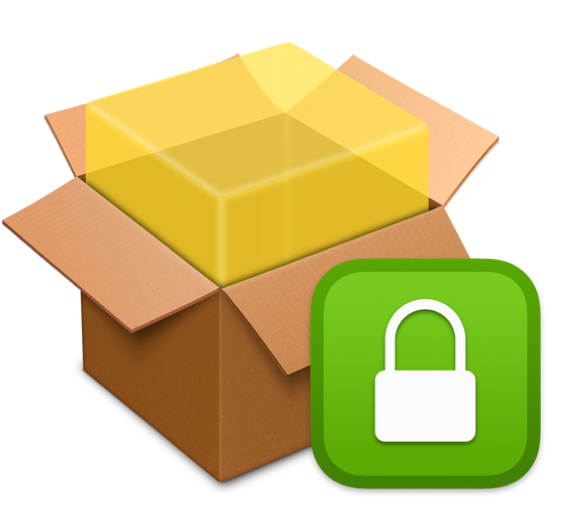
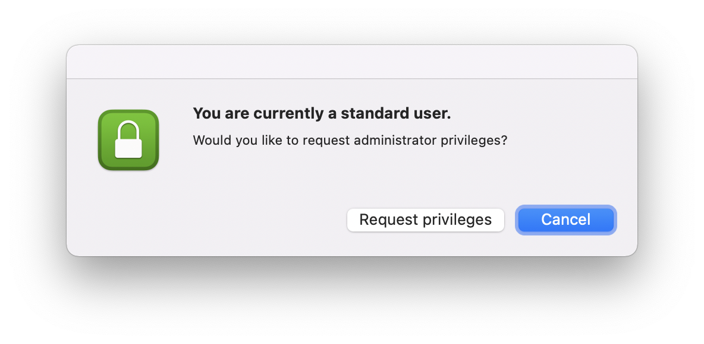

# sap-privileges-installer

## About 

Use this repo to assist in deploying the [SAP Enterprise Privileges App](https://github.com/SAP/macOS-enterprise-privileges) to your Mac fleet.

The base installation of Privileges does not have a way to remove user privileges automatically if the priviliges app is launched by clicking on the app and then selecting **Request privileges**. In this scenario the user will remain an admin until they manually remove their own privileges by launching the app again.

**Enter privilegeschecker.sh ...**

Using this script, plus an associated LaunchAgent, an IT admin can set a default amount of time for the user to remain an admin and automatically toggle the user back to standard , even with preference keys enabled. The script does this by first checking the currently logged-in user's privilege level. Then, using the SAP `PrivilegesCLI` binary, demotes the user back to standard if they are an admin.

A sample LaunchAgent can be found in this repo [here](https://github.com/captam3rica/sap-privileges-installer/blob/master/payload/Library/LaunchAgents/com.github.captam3rica.privileges.checker.plist).

### About Privileges.app

**Privileges.app** for macOS is designed to allow users to work as a standard user for day-to-day use, by providing a quick and easy way to get administrator rights when needed. When you do need admin rights, you can get them by clicking on the **Privileges** icon in your Dock.

More info about the Privileges.app can be found in the SAP [macOS Enterprise Privileges](https://github.com/SAP/macOS-enterprise-privileges) Repo

Sample preference files to managed Privileges can be found [here](https://github.com/SAP/macOS-enterprise-privileges/tree/main/application_management).

## Requirements

**privilegeschecker** supports the following macOS versions:

* macOS 12.0.1
* macOS 11.x
* macOS 10.15.x

## Deployment steps

1. Create a package. 
    - The [Packages.app](http://s.sudre.free.fr/Software/Packages/about.html) tool was used here, but any packaging method can be used.
    - A sample `.pkgproj` file can be found in this repo [here](https://github.com/captam3rica/sap-privileges-installer/tree/master/sample-packages-project)
2. Upload the package to your MDM.
3. Deploy the package to your Mac fleet.

## Support

This project is 'as-is' with no support. You are welcome to make changes to improve it but we are not available for questions or support of any kind.
