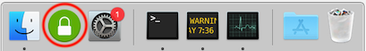
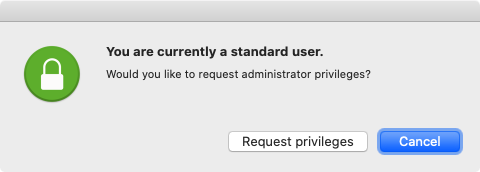
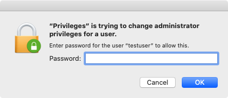
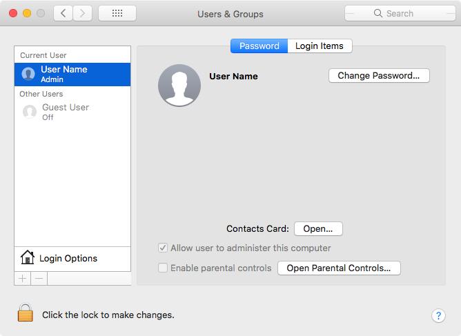
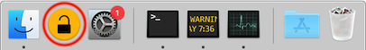
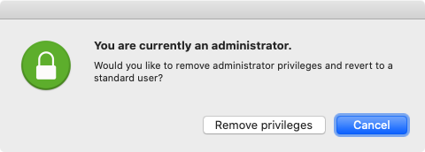
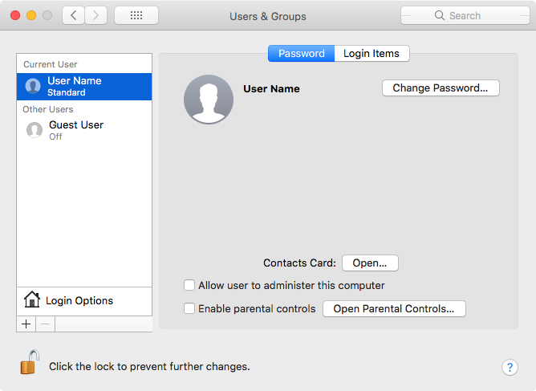

# How to Use Privileges.app

If your macOS user account has standard privileges and you need admin rights, verify that the **Privileges.app** icon  is in your dock or is installed in your Applications folder then use the following procedure:

1. Launch **Privileges.app** 
    
    

2. Click the `Request Privileges` button.

    

3. Enter the password that you used to login to your Mac.

    

4. The **Privileges** dock icon should change to look like a yellow unlocked padlock .
5. A **Privileges have been changed successfully** message should appear.

6. The logged-in account should now have admin rights.

    

If your macOS user account has admin privileges and you want to go back to standard rights, verify that the **Privileges.app** icon  is in your dock or is installed in your Applications folder then use the following procedure:

1. Launch **Privileges.app**.

    

2. Click the `Remove Privileges` button.

    

3. The **Privileges** dock icon should change to look like a green locked padlock .
4. A **Privileges have been changed successfully** message should appear.

    **NOTE**: If you forget to go back to standard user privileges while performing normal tasks **Privileges.app** will automatically add standard user privileges back to your user account **15 minutes** after the admin privileges were requested. ☺️

5. The logged-in account should now be a standard user account.

    
